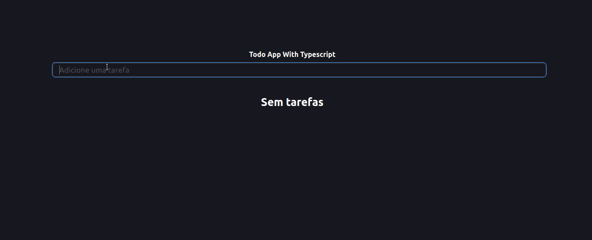

# Bem Vindo ao React TODO App

## Projeto desenvolvido com React + Typescript + styled-components

## Tecnologias utilizadas

- React
- Typescript
- styled-components
- react-testing-library(RTL)

## Instruções de Instalação

1. Clone o repositorio

`https://github.com/marcusjava/todo-typescript`

2. Instalação

- `yarn install`
- `yarn start`
